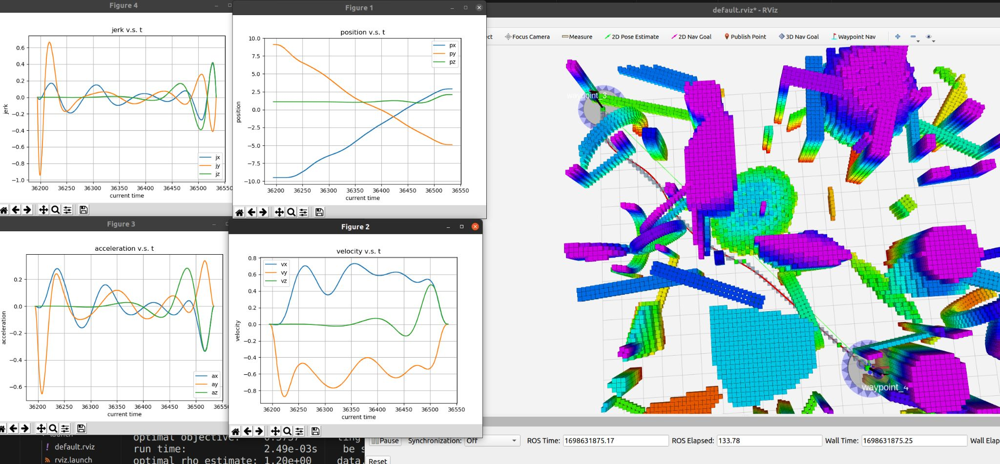
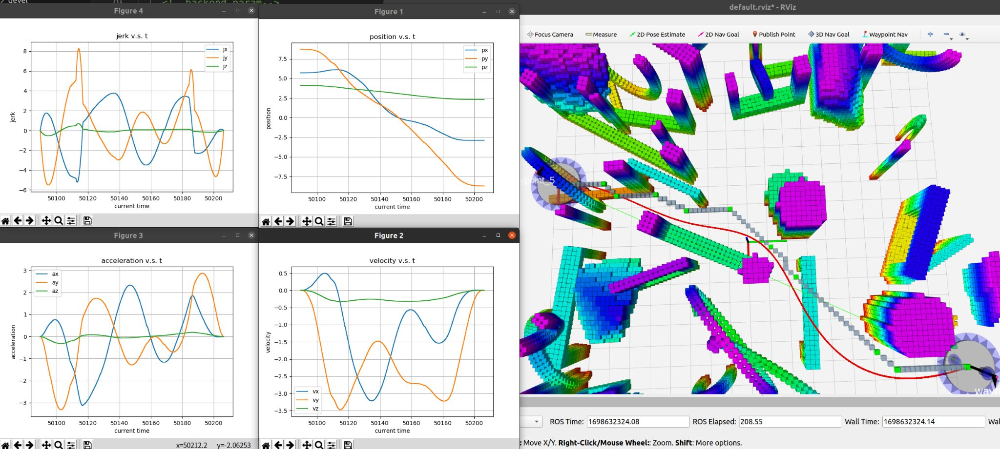

# kumar-lab-motion-planning-entry-level-proj              

reference repo: 
- https://github.com/KumarRobotics/kr_mav_control
- https://github.com/sikang/DecompUtil

##  About
- motion planning entry level project
- trajectory generation using optimization-based method(minimum snap)

## methods  
### method 1  
- front-end path search: A* + Ramer–Douglas–Peucker
- back-end optimization: 7th polynomial trajectory generation in dense and small corridors (reference: Minimum Snap Trajectory Generation and Control for Quadrotors)
- performance: average running time: frontend: ~30ms, backend: ~80ms with slow velocity, acceleration and jerk.
- [video1](https://youtu.be/yAZ2K34y-sc) 
<p align="center">
  
</p>


### method 2
- front-end path search: A* + Ramer–Douglas–Peucker
- back-end optimization: 7th polynomial trajectory generation in convex polyhedron corridors (reference: Planning_Dynamically_Feasible_Trajectories_for_Quadrotors_Using_Safe_Flight_Corridors_in_3D_Complex_Environments)
- performance: average running time: frontend: ~30ms, backend: ~300ms with fast velocity, acceleration and jerk.
- [video2](https://youtu.be/Mxb7C_kNfv0) 
<p align="center">
  
</p>


## build on ROS-noetic
upzip src1.zip(method 1) or src2.zip(method 2) and rename it src
```
mkdir ws
catkin_make
```

## run
- in ws path
```
source devel/setup.bash
roslaunch param_env structure_map.launch
rosrun kr_trackers waypoints_to_action.py __ns:=quadrotor
rosrun rqt_mav_manager rqt_mav_manager
```


